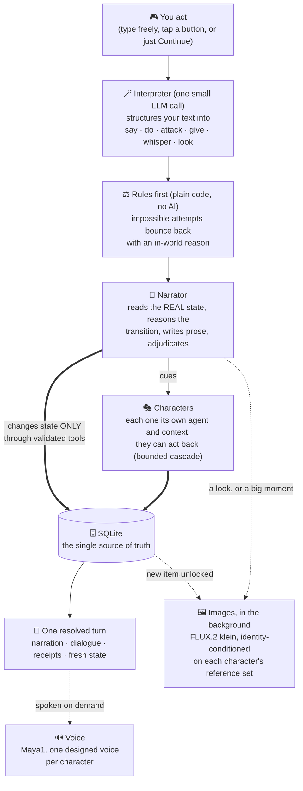

# 🎲 Gamentic

A self-hosted AI dungeon role-playing game you play in the browser, running entirely on your own machine. An AI narrator and a cast of AI characters (each with their own persona and voice) drive a living, branching story. No cloud and no API keys: the text, images, and voice are all generated locally.

> Built and tuned for an AMD Strix Halo APU (Ryzen AI Max), on standard containers.

  -blue)  

## ✨ What you do

- 🗺️ Explore scenes, find ways out, search for hidden things.
- 💬 Talk to characters, each its own AI with its own voice and agenda.
- ⚔️ Fight, give, take, trade: characters can act on each other and on you, not just talk.
- 🤫 Pull a character aside for a private word no one else hears.
- 👁️ Look at anything ("where is Mara looking?", "that ship on the horizon"): looking is a real story action that can trigger reactions and discoveries, and every look earns an image (the narrator's own framing when it offers one, a state-grounded snapshot otherwise). The narrator also fires images on its own at big moments, paced so they stay special.
- 🧬 Watch characters grow: personality traits unlock as your interactions reveal them, their pasts surface piece by piece (they hint early, open up with trust, and answer "who are you?" properly), relationships get named and renamed by the story (stranger, ally, sworn rival), and each character keeps a profile of traits, pivotal shared moments and the image memories they are actually part of.
- 🧠 The story never falls out of memory: the narrator re-reads recent scenes word-for-word and auto-compresses everything older into a rolling recap, with the depth, the cadence and a hard context budget all live settings per game.
- 🎒 New items arrive with their own small generated card in the chat.
- ▶️ Hit Continue and let the story advance on its own when you'd rather watch.
- 🎚️ Pick how much the world bends: easy (the player leads, wishes come true), normal, or hard (the world leads, consequences bite). Changeable mid-game, and you can always whisper a wish for what you hope happens next.
- 🎯 Chase quests and a goal the story keeps up to date as you play.
- 📦 Export any adventure as a shareable template (others play it fresh) or a checkpoint save (resume or share an exact moment).

## 🧠 The brain

FastAPI + SQLite. One local LLM plays the narrator and every character through separate contexts. It writes prose and proposes changes only by calling validated tools; the database is the source of truth, so the model never owns game state (LLMs hallucinate state, a database does not). Plain REST, sequential: one request returns one fully resolved turn.

## 🔁 How a turn works



Every box on the left talks to the same single local model, just with different, purpose-built contexts; everything it wants to do to the world must pass through a validated tool into the database. A map of where each piece lives is in [orchestrator/INDEX.md](orchestrator/INDEX.md).

## 🧩 The state machine (the heart of it)

Gamentic treats the world as an explicit state machine, and the narrator is the engine that advances it. Every turn it reasons (silently, in its prompt) about the transition: what is the state now, what actions and dialogue just happened, what did the player actually do, and therefore what changes, what is kept, and what transitions.

What the state tracks:

- 🏚️ **Scenes as real places:** description, mood (calm / tense / dangerous), exits (with an automatic way back so you are never stranded), and their own inventory that persists when you leave and return.
- 👤 **Characters:** disposition toward you (friendly / neutral / hostile / unknown), whether they follow you between scenes, HP, and what they carry.
- 🎒 **Items:** loose loot you can pocket vs fixed scenery you cannot, plus hidden items you only find by searching.
- 🎯 **Progression:** quests, objectives, points, life, and a current goal.
- ⏳ **Time:** a fictional story clock. A few minutes pass with every action, the narrator jumps it for rests and journeys, and days and times of day derive from it.
- 📓 **Draft / pending layer:** when you leave a place, the world keeps a draft of how you left it (its items, who was there, the open threads). That snapshot is what makes the world persistent: return later and it is as you left it, and the narrator reasons about what plausibly changed while you were gone.

Everything is bounded by caps (max items, characters, exits, actions) on purpose. Bounded state is what keeps the story consistent and the model honest.

## 🗣️ Why the "Heretic" model

The text model is an uncensored ("heretic") finetune of Gemma (`igorls/gemma-4-12B-it-heretic`, GGUF Q4) on llama.cpp with Vulkan. It was chosen deliberately: a dungeon needs characters that can genuinely act (attack, betray, scheme, make morally grey choices) and a narrator that stays inside the fiction instead of refusing or moralizing. The uncensored variant buys that creative freedom and keeps characters in character.

## 🖼️ Image (optional)

**FLUX.2 [klein] 4B** (the distilled, few-step variant) running in ComfyUI behind a small REST adapter, generating scene and character art. The exact model set (Comfy-Org repacks, the official ComfyUI Klein template, around 16 GB total):

- diffusion model: `flux-2-klein-4b.safetensors`
- text encoder: `qwen_3_4b.safetensors` (FLUX.2 uses a Qwen3-4B encoder)
- VAE: `flux2-vae.safetensors`

Optional: the game is fully playable text-only, and art fills in as it is generated.

## 🔊 Voice (optional)

**Maya1-3B** (Maya Research) running as GGUF on llama.cpp with Vulkan, decoded to 24 kHz audio through the SNAC codec on CPU. Each character gets a *designed* voice composed from their sheet (gender, age, pitch, tone, accent) and stored in a persistent registry, so one character is always one voice. Lines support 20+ inline emotion tags (`[whisper]`, `[laugh]`, `[angry]`, ...) and a streaming endpoint delivers first audio in ~0.3s. Optional, synthesized on demand.

## 🚀 Run it

Requires Docker (with GPU access for the model and the image service) and local model files on disk.

```bash
cp infra/.env.example infra/.env   # then set MODELS_DIR and the model file paths
docker compose up -d --build       # from the repo root; the stack lives in infra/
```

| Service | URL | Tech stack |
|---|---|---|
| 🎮 Frontend | http://localhost:5173 | Vanilla HTML / CSS / JS, served by nginx |
| 🧠 Orchestrator (game API) | http://localhost:8000 | FastAPI, SQLite, httpx, Python 3.12 |
| 📝 Text model | http://localhost:8080 | llama.cpp (Vulkan), `gemma-4-12B-it-heretic` GGUF Q4 |
| 🖼️ Image | http://localhost:9001 | ComfyUI + FLUX.2 [klein] 4B (distilled), FastAPI REST adapter |
| 🔊 Voice model | http://localhost:9091 | llama.cpp (Vulkan), Maya1-3B GGUF |
| 🔊 Voice API | http://localhost:9002 | FastAPI: voice design, character registry, SNAC decode (CPU), streaming |

Open the frontend, create a world by chatting with the story creator, and play.

## 🗂️ Layout

```
gamentic/
  orchestrator/   game brain (FastAPI + SQLite, narrator + character agents, tools)
  frontend/       vanilla HTML / CSS / JS client
  infra/          docker-compose stack + image service
  voice-api/      Maya1 TTS service (voice design, character registry, streaming)
```

## 🧪 Status

Active personal project, in progress and under heavy iteration. The brain and the services run and are covered by an automated test suite (deterministic tests plus live tests against the real model). The frontend is being redesigned right now. Expect rough edges.

## ⚠️ Known issues and limitations

Being honest about where it stands today:

- 🔊 **Voice is near-realtime, not instant.** Generation runs at ~1.1-1.2x realtime (a 10 second line takes 11-12 seconds to fully render); the streaming endpoint masks it with ~0.3s to first audio. English only for now.
- 🖼️ **Images can be small or plain,** and scene art is still being wired into the UI cleanly.
- 🧠 **Some limits are model-based.** A 12B Q4 model on local hardware will occasionally miss a tool call, repeat itself, or under-furnish a scene. The brain adds structure to fight this: a no-dead-air narration pass, bounded state, and explicit transition reasoning.
- 🛠️ We are actively optimizing all of this, to make it as good as the local model and hardware allow.

## 📜 Models and licenses

Gamentic is just the harness. It does NOT distribute, host, or bundle any model weights. You bring your own, downloaded from their official sources, and each model stays the property of its authors under its own license and terms, which you are responsible for following. Read them at the source:

- 📝 **Text, Gemma (Google).** The game runs a community uncensored finetune of Google's Gemma. Gemma and its derivatives are governed by Google's own terms, not by this repository:
  - Gemma Terms of Use: https://ai.google.dev/gemma/terms
  - Gemma Prohibited Use Policy: https://ai.google.dev/gemma/prohibited_use_policy
  - The specific finetune used: https://huggingface.co/igorls/gemma-4-12B-it-heretic-GGUF
- 🖼️ **Image, FLUX.2 [klein] 4B (Black Forest Labs),** under Apache-2.0:
  - Model: https://huggingface.co/black-forest-labs/FLUX.2-klein-4B
  - Black Forest Labs licensing: https://bfl.ai/licensing
- 🔊 **Voice, Maya1 (Maya Research),** under Apache-2.0:
  - https://huggingface.co/maya-research/maya1
- ⚙️ **Runtimes** are used as-is under their own licenses: llama.cpp (MIT) and ComfyUI (GPL-3.0).

Nothing in this repository grants you any rights to those models. If you swap in a different model, follow that model's license. Gamentic simply orchestrates whatever local models you point it at.

Gamentic's own code is **MIT licensed** (see [LICENSE](LICENSE)). Changes are tracked in the [CHANGELOG](CHANGELOG.md).
</content>
