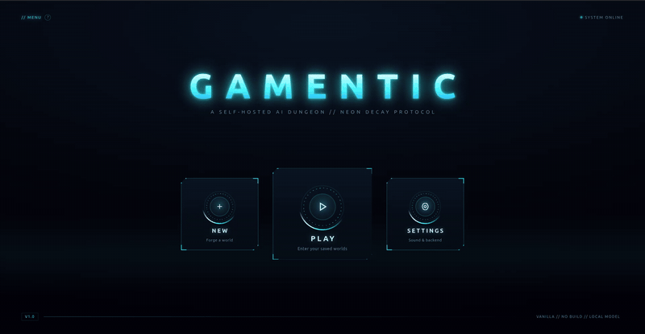
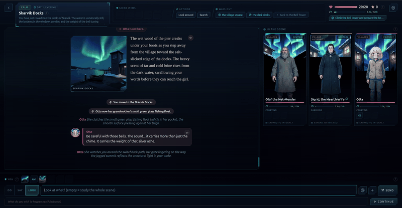
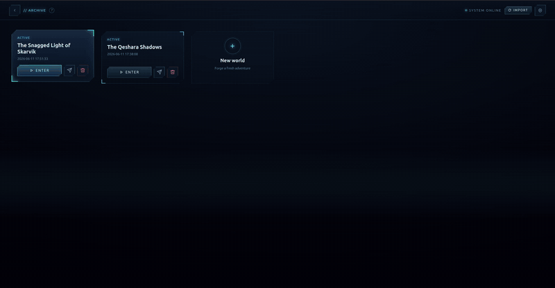
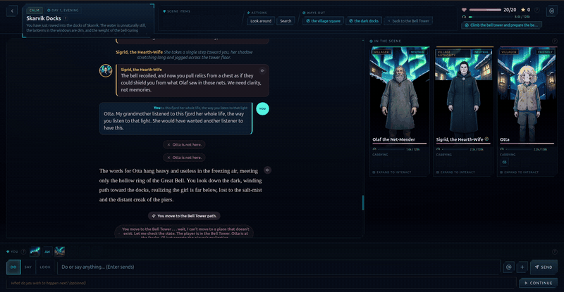
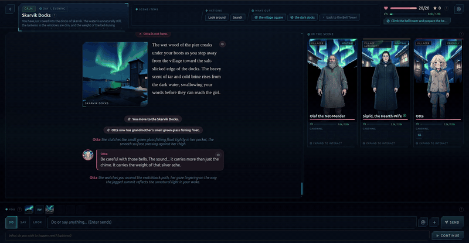
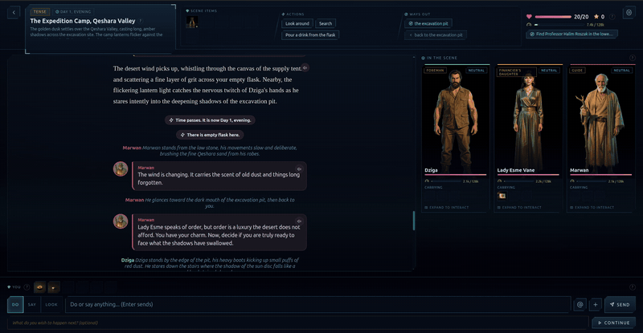
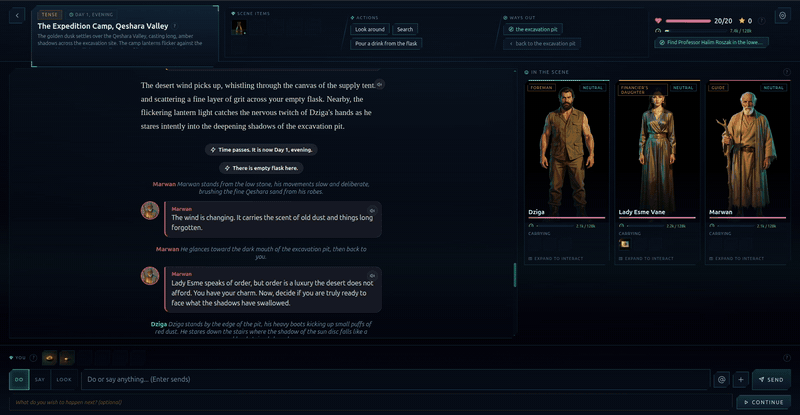

# Gamentic

A self-hosted AI dungeon RPG you play in the browser. An AI narrator and a cast of AI characters, each with its own persona, memory and voice, drive a branching story over real game state. Everything runs on your own machine: the text, the images and the voice are all generated locally. No cloud, no API keys.

### <a href="https://hec-ovi.github.io/gamentic/" target="_blank" rel="noopener noreferrer">📖 Explore the interactive docs &amp; blueprints →</a>

Pannable, clickable maps of the agents, the engine, the state, the infra and the code tree, each paired with an agent-ready markdown guide.

> Built and tuned for an AMD Strix Halo APU (Ryzen AI Max), on standard containers.

  -blue)   

## In motion

| | |
|---|---|
|  **Boot to menu.** |  **Your adventures, enter or forge a new world.** |
|  **Into the story: scene art, prose, the cast assembling.** |  **"Look at" is a full action: every look generates an image; click any image to expand it.** |
|  **New items land in the story with their own generated card.** |  **Tap any event for what it means and what you might do next.** |
|  **The private channel: whisper with one character, study them quietly, say things no one else in the scene hears.** | |

## The game

- Explore scenes, search for hidden things, find ways out. Talk to characters: each one is its own agent with its own voice, agenda and secrets, and they can act on you and on each other, not just talk.
- Pull a character aside for a private conversation. What they tell you there persists: each character keeps its own memory of what it shared with you, and its profile (past, traits, pivotal moments, image memories) grows out of how you treat it. Give someone a gift and they reply privately. Characters can open a whisper with you first, and unread whispers show as a badge on their card.
- Look at anything ("where is Mara looking?", "that ship on the horizon"). Looking is a full game action: it can trigger reactions and discoveries, and each look generates an image. The narrator also generates images at key moments, spaced out so they stay special.
- Characters grow. Personality traits unlock as the story reveals them and feed back into how that character behaves. Their pasts surface piece by piece: they hint early, open up with trust, and answer "who are you?" properly when asked. Relationships get named and renamed by the story (stranger, ally, sworn rival). Even their action buttons follow the story: the narrator offers one-off contextual actions out of your shared history, and stale ones rotate away.
- The narrator keeps the whole story in context: it re-reads recent scenes word for word and folds older ones into a rolling recap. Window depth, fold cadence, and a hard context budget are per-game settings you can change while playing.
- New items arrive with their own small generated card. Quests and a current goal keep up to date as you play.
- Hit Continue and the story advances on its own; you can always whisper a wish for what you hope happens next.
- A difficulty setting controls how hard the world pushes back: easy (you lead, your wishes tend to come true), normal, or hard (the world leads, and failure costs you). Changeable mid-game. You can win the story, and you can lose; a staged rescue can pull you back from the brink.
- Export any adventure as a shareable template (others play it fresh) or a checkpoint (resume or share an exact moment).

## How a turn works


One local model plays every role, each through its own purpose-built context. Anything it does to the world has to pass through a validated tool that writes to the database, the single source of truth, so the model can't alter the game's actual state just by hallucinating it. The API is plain REST and sequential: one request returns one fully resolved turn. A single server-sent-events stream announces background media as it finishes, so art appears without the client polling. A map of where each piece lives is in [orchestrator/INDEX.md](orchestrator/INDEX.md).

## The world model

The world is an explicit state machine, and the narrator is the engine that advances it: each turn it works out what changes, what stays, and what transitions. The state tracks scenes as persistent places (description, mood, exits, their own inventory, and a draft of how you left them, so returning later finds the world as it was, plausibly aged), characters (disposition, relation, HP, what they carry, unlocked traits, origin, shared moments), items (loose loot vs fixed scenery, hidden until found), progression (quests, objectives, points, life, a current goal), and a fictional story clock that keeps advancing. Everything is capped on purpose: bounded state keeps the story consistent and the model's output grounded in real data.

## The models

**Text** is an uncensored ("heretic") finetune of Gemma 4 26B-A4B, a mixture-of-experts model (`mradermacher/gemma-4-26B-A4B-it-heretic-GGUF`, Q4_K_M) on llama.cpp with Vulkan: 26B of knowledge with about 4B active per token, so it writes like a big model and generates at small-model speed (measured on the reference box: ~900-1000 tok/s prefill, ~55 tok/s decode). The heretic finetune is deliberate: a dungeon needs characters that can genuinely act (attack, betray, scheme, make morally grey choices) and a narrator that stays inside the fiction instead of refusing or moralizing.

**Image** is FLUX.2 [klein] 4B distilled in ComfyUI behind a small REST adapter: scene art, a 3-view reference set per character, identity-conditioned story shots, item cards. Every image is art-directed: at creation one pass reads the whole world bible and writes the first-sight prompts (every character's reference look first, then the main opening image, conditioned on the fresh portraits), and after that each render gets its own art-director call that writes a detailed prompt (poses, depth, lighting) from the live scene context, bounded only by the encoder's 512-token window, with deterministic template prompts as the fallback. The model set is the Comfy-Org repack (`flux-2-klein-4b` + `qwen_3_4b` encoder + `flux2-vae`, about 16 GB). The game is fully playable text-only; art fills in as it renders.

**Voice** is Maya1-3B as GGUF on llama.cpp Vulkan, decoded to 24 kHz audio through the SNAC codec on CPU. Each character gets a designed voice composed from their sheet (gender, age, pitch, tone, accent), stored with the character in the game database, so one character is always one voice. Lines carry inline emotion tags (`[whisper]`, `[laugh]`, `[angry]`, ...) and render at roughly realtime speed on the reference box.

## Run it

Requires Docker (with GPU access for the model and the image service) and local model files on disk. Configure first, three ways to taste, then start the stack:

```bash
# 1. console-shy: double-click setup.html, answer the questions, save the .env it makes
# 2. terminal:    ./gamentic-setup        (same questions; Windows: gamentic-setup.bat)
# 3. expert:      cp .env.example .env    and edit it yourself

./up.sh                        # start (or: docker compose up -d --build)
./up.sh harness                # everything except the text model: images and voice
                               # run locally, text turns go to an external llama
                               # server (default localhost:8090)
```

Both faces ask the identical questions from one shared schema
(`infra/setup/schema.js`), write a complete `.env`, and never send your keys
anywhere (the HTML page makes zero network calls). `./gamentic-setup doctor`
checks the host first: docker, GPU nodes, model files, free ports, config
pitfalls. `./up.sh` starts the full local stack; `./up.sh harness` swaps only the
text model for an external server. `./up.sh down` stops everything.

| Service | URL | Tech stack |
|---|---|---|
| Frontend | http://localhost:5173 | Vanilla HTML / CSS / JS, served by nginx |
| Orchestrator (game API) | http://localhost:8000 | FastAPI, SQLite, httpx, Python 3.12 |
| Text model | http://localhost:8080 | llama.cpp (Vulkan), `gemma-4-26B-A4B-it-heretic` GGUF Q4 (MoE) |
| Image | http://localhost:9001 | FastAPI REST adapter over ComfyUI + FLUX.2 [klein] 4B (ComfyUI itself at :8188) |
| Voice model | http://localhost:9091 | llama.cpp (Vulkan), Maya1-3B GGUF |
| Voice API | http://localhost:9002 | FastAPI: Maya1 synthesis, SNAC decode (CPU), streaming |

Open the frontend, create a world by chatting with the story creator, and play.

```
gamentic/
  orchestrator/   game brain (FastAPI + SQLite, narrator + character agents, tools)
  frontend/       vanilla HTML / CSS / JS client
  infra/          ComfyUI + image-api, the setup faces
  voice-api/      Maya1 TTS service (synthesis + streaming; voice identity lives in the game DB)
  setup.html      the double-click setup face; gamentic-setup is the CLI one
```

## Bring your own inference

The game logic stays the same whatever models you run behind it. Each modality sits behind a
small interface, and you choose the provider in config:

```
engine (all game logic: prompts, memory, identity, pacing)
   |
provider layer (one interface per modality + tiny dialect translators)
   |
text          audio                image
local llama.cpp   local Maya1 renderer   local ComfyUI + templates   <- shipping defaults
OpenAI-compatible OpenAI / ElevenLabs    OpenAI gpt-image / Google
endpoints / fal   / fal (incl. Maya1)    nano banana / fal
```

What stays with the game no matter the provider: character voice identity (each
character's designed voice lives in the game database, so switching providers never
fractures a voice mid-story), emotion semantics (a tone is rendered as inline tags, an
instructions field, or quietly dropped, by what the provider supports), image identity
policy (seed-based on ComfyUI, reference-based on cloud models), and every prompt. The
provider only ever sees the most primitive request its kind allows: text in, completion
out; text plus voice in, audio out; prompt plus references in, image out.

It is all `.env`: four variables per modality (audio adds a fifth for the voice),
`TEXT_PROVIDER/_BASE_URL/_API_KEY/_MODEL`, same for `AUDIO_*` and `IMAGE_*`.
Defaults run the local stack untouched; point `TEXT_BASE_URL` at any
OpenAI-compatible endpoint with a key and the narrator runs on it. The setup
faces (custom mode) ask these questions for you; experts edit the file directly.
Changes land on the next `./up.sh`.

Testing status: the local paths (llama.cpp, Maya1, ComfyUI) are the live-tested
defaults this project runs on. The cloud dialects (OpenAI, Google, ElevenLabs, fal) are
implemented against their published schemas and pinned by contract tests, but not
verified against the paid live services. If you hold a key, your first played turn is
the verification, and reports are welcome.

### Anna version

Gamentic won 1st place at the Anna hackathon. That version lives at
[gamentic-anna](https://github.com/hec-ovi/gamentic-anna).

## Status and limits

Stable. Over a thousand automated tests cover the brain, the services and the frontend (663 backend, 240 frontend component tests, plus per-service suites), every route exercised against real SQLite with the model faked at the one LLM boundary, and the whole loop soak-tested with full played adventures against the real stack. Known physics of running everything locally:

- Voice is near-realtime, not instant: a 10 second line takes 11-12 seconds to fully render. English only.
- Images render in the background and arrive seconds late by design (the turn never waits for art); the 4B image model occasionally sneaks lettering into a corner.
- Deep story memory costs speed: turn time grows with the story window you choose (prefill measures about 1s per 900 tokens on the reference hardware). The story-memory settings exist precisely to pick your own point on that curve.
- A local Q4 model, even at 26B, will sometimes narrate a tool call instead of actually making it. The orchestrator handles this with structure rather than hoping the model behaves: a deterministic movement router, validated tools with bounded state, adjudication that accepts by default, output sanitizers on every path, and parsers that read the model's intent even when it writes the call as prose.

## Models and licenses

Gamentic is just the harness. It does not distribute, host, or bundle any model weights. You bring your own from their official sources, and each model stays the property of its authors under its own license and terms, which you are responsible for following:

- **Text, Gemma (Google).** The game runs a community uncensored finetune of Google's Gemma. Gemma and its derivatives are governed by Google's own terms, not by this repository: [Gemma Terms of Use](https://ai.google.dev/gemma/terms), [Prohibited Use Policy](https://ai.google.dev/gemma/prohibited_use_policy), [the finetune used](https://huggingface.co/mradermacher/gemma-4-26B-A4B-it-heretic-GGUF).
- **Image, FLUX.2 [klein] 4B (Black Forest Labs),** Apache-2.0: [model](https://huggingface.co/black-forest-labs/FLUX.2-klein-4B), [BFL licensing](https://bfl.ai/licensing).
- **Voice, Maya1 (Maya Research),** Apache-2.0: [model](https://huggingface.co/maya-research/maya1).
- **Runtimes** under their own licenses: llama.cpp (MIT), ComfyUI (GPL-3.0).

Nothing in this repository grants you any rights to those models. If you swap in a different model, follow that model's license.

Gamentic's own code is **MIT licensed** (see [LICENSE](LICENSE)). Changes are tracked in the [CHANGELOG](CHANGELOG.md).
