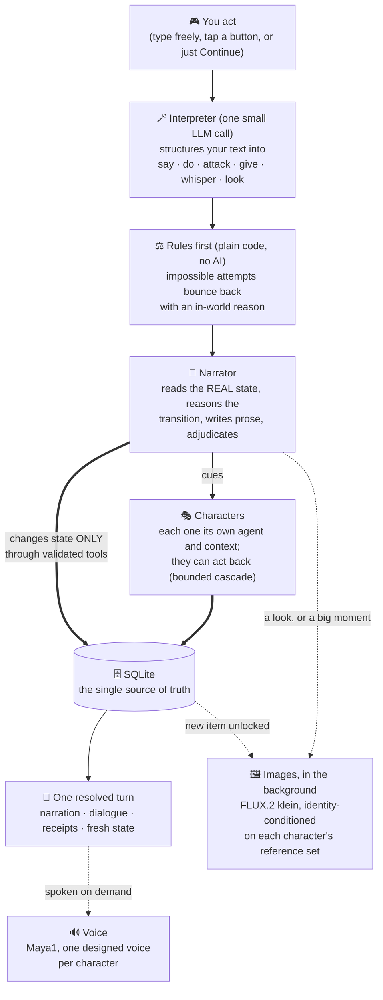

# Gamentic

A self-hosted AI dungeon RPG you play in the browser. An AI narrator and a cast of AI characters, each with its own persona, memory and voice, drive a branching story over real game state. Everything runs on your own machine: the text, the images and the voice are all generated locally. No cloud, no API keys.

> Built and tuned for an AMD Strix Halo APU (Ryzen AI Max), on standard containers.

  -blue)  

## The game

- Explore scenes, search for hidden things, find ways out. Talk to characters: each one is its own agent with its own voice, agenda and secrets, and they can act on you and on each other, not just talk.
- Pull a character aside for a private word no one else hears.
- Look at anything ("where is Mara looking?", "that ship on the horizon"). Looking is a real story action that can trigger reactions and discoveries, and every look earns an image. The narrator also fires images at big moments, paced so they stay special.
- Characters grow. Personality traits unlock as the story reveals them and feed back into how that character behaves. Their pasts surface piece by piece: they hint early, open up with trust, and answer "who are you?" properly when asked. Relationships get named and renamed by the story (stranger, ally, sworn rival). Each character keeps a profile of traits, pivotal shared moments and the image memories they are actually part of.
- The story never falls out of memory. The narrator re-reads recent scenes word for word and folds everything older into a rolling recap; window depth, fold cadence and a hard context budget are live settings per game.
- New items arrive with their own small generated card. Quests and a current goal keep up to date as you play.
- Hit Continue and the story advances on its own; you can always whisper a wish for what you hope happens next.
- Pick how much the world bends: easy (the player leads, wishes come true), normal, or hard (the world leads, consequences bite). Changeable mid-game. The story can be won, and you can fall; a staged rescue can bring you back from the brink.
- Export any adventure as a shareable template (others play it fresh) or a checkpoint (resume or share an exact moment).

## How a turn works



One local model plays every role through separate, purpose-built contexts. Whatever it wants to do to the world must pass through a validated tool into the database, which is the single source of truth: LLMs hallucinate state, a database does not. Plain REST, sequential, one request returns one fully resolved turn. A map of where each piece lives is in [orchestrator/INDEX.md](orchestrator/INDEX.md).

## The world model

The world is an explicit state machine and the narrator is the engine that advances it: each turn it reasons about what changes, what is kept, and what transitions. The state tracks scenes as real places (description, mood, exits, their own inventory, and a draft of how you left them, so returning later finds the world as it was, plausibly aged), characters (disposition, relation, HP, what they carry, unlocked traits, origin, shared moments), items (loose loot vs fixed scenery, hidden until found), progression (quests, objectives, points, life, a current goal) and a fictional story clock that never freezes. Everything is bounded by caps on purpose: bounded state keeps the story consistent and the model honest.

## The models

**Text** is an uncensored ("heretic") finetune of Gemma 4 26B-A4B, a mixture-of-experts model (`mradermacher/gemma-4-26B-A4B-it-heretic-GGUF`, Q4_K_M) on llama.cpp with Vulkan: 26B of knowledge with about 4B active per token, so it writes like a big model and generates at small-model speed (measured on the reference box: ~900-1000 tok/s prefill, ~55 tok/s decode). The heretic finetune is deliberate: a dungeon needs characters that can genuinely act (attack, betray, scheme, make morally grey choices) and a narrator that stays inside the fiction instead of refusing or moralizing.

**Image** (optional) is FLUX.2 [klein] 4B distilled in ComfyUI behind a small REST adapter: scene art, a 3-view reference set per character, identity-conditioned story shots, item cards. The model set is the Comfy-Org repack (`flux-2-klein-4b` + `qwen_3_4b` encoder + `flux2-vae`, about 16 GB). The game is fully playable text-only; art fills in as it renders.

**Voice** (optional) is Maya1-3B as GGUF on llama.cpp Vulkan, decoded to 24 kHz audio through the SNAC codec on CPU. Each character gets a designed voice composed from their sheet (gender, age, pitch, tone, accent) and stored in a registry, so one character is always one voice. Lines carry inline emotion tags (`[whisper]`, `[laugh]`, `[angry]`, ...) and a streaming endpoint delivers first audio in about 0.3s.

## Bring your own inference

Gamentic's brain is comfortable; its inference is nobody's. Each modality sits behind a
small interface, and what stands behind it is config, not code:

```
engine (all game logic: prompts, memory, identity, pacing)
   |
provider layer (one interface per modality + tiny dialect translators)
   |
text          audio                image
local llama.cpp   local Maya1 renderer   local ComfyUI + templates   <- shipping defaults
OpenAI-compatible OpenAI / ElevenLabs    OpenAI gpt-image / Google
endpoints / fal   / fal (incl. Maya1)    nano banana / fal
```

What stays with the game no matter the provider: character voice identity (each
character's designed voice lives in the game database, so switching providers can never
fracture a voice mid-story), emotion semantics (a tone is rendered as inline tags,
as an instructions field, or quietly dropped, depending on what the provider can do),
image identity policy (seed-based on ComfyUI, reference-based on cloud models), and
every prompt. The provider only ever sees the most primitive request its kind allows:
text in, completion out; text plus voice in, audio out; prompt plus references in,
image out.

Two ways to configure it:

- **Experts**: environment variables, three per modality.
  `TEXT_PROVIDER/_BASE_URL/_API_KEY/_MODEL`, same for `AUDIO_*` and `IMAGE_*`.
  Defaults run the local stack untouched. Point `TEXT_BASE_URL` at any
  OpenAI-compatible endpoint with a key and the narrator runs on it.
- **Everyone else**: open `/admin` on the orchestrator: pick a provider per modality,
  paste a key, press TEST, save. Changes apply on the next call, no restart. Keys stay
  on the server and never reach the browser. Set `ADMIN_TOKEN` to gate the panel.

Honesty about testing: the local paths (llama.cpp, Maya1, ComfyUI) are the live-tested
defaults this project runs on. The cloud dialects (OpenAI, Google, ElevenLabs, fal) are
implemented against their published schemas and pinned by contract tests, but have not
been verified against the paid live services. If you hold a key, the TEST button is the
verification, and reports are welcome.

## Run it

Requires Docker (with GPU access for the model and the image service) and local model files on disk.

```bash
cp .env.example .env           # then set MODELS_DIR and the model file paths
docker compose up -d --build   # from the repo root
```

| Service | URL | Tech stack |
|---|---|---|
| Frontend | http://localhost:5173 | Vanilla HTML / CSS / JS, served by nginx |
| Orchestrator (game API) | http://localhost:8000 | FastAPI, SQLite, httpx, Python 3.12 |
| Text model | http://localhost:8080 | llama.cpp (Vulkan), `gemma-4-26B-A4B-it-heretic` GGUF Q4 (MoE) |
| Image | http://localhost:9001 | ComfyUI + FLUX.2 [klein] 4B (distilled), FastAPI REST adapter |
| Voice model | http://localhost:9091 | llama.cpp (Vulkan), Maya1-3B GGUF |
| Voice API | http://localhost:9002 | FastAPI: voice design, character registry, SNAC decode (CPU) |

Open the frontend, create a world by chatting with the story creator, and play.

```
gamentic/
  orchestrator/   game brain (FastAPI + SQLite, narrator + character agents, tools)
  frontend/       vanilla HTML / CSS / JS client
  infra/          docker-compose stack + image service
  voice-api/      Maya1 TTS service (voice design, character registry, streaming)
```

## Status and limits

Active personal project under heavy iteration. The brain, the services and the frontend are covered by automated test suites and the whole loop has been soak-tested with full scripted adventures against the real stack. Where it honestly stands:

- Voice is near-realtime, not instant: a 10 second line takes 11-12 seconds to fully render. English only for now.
- Images render in the background and arrive seconds late by design (the turn never waits for art); the 4B image model occasionally sneaks lettering into a corner.
- Deep story memory costs speed: turn time grows with the story window you choose (prefill is about 1s per 600 tokens on the reference hardware). The story-memory settings exist precisely to pick your own point on that curve.
- A 12B Q4 model on local hardware will occasionally miss a tool call or repeat itself. The brain fights this with structure: bounded state, deterministic guards, adjudication with default-accept, and a no-dead-air narration pass.

## Models and licenses

Gamentic is just the harness. It does not distribute, host, or bundle any model weights. You bring your own, downloaded from their official sources, and each model stays the property of its authors under its own license and terms, which you are responsible for following:

- **Text, Gemma (Google).** The game runs a community uncensored finetune of Google's Gemma. Gemma and its derivatives are governed by Google's own terms, not by this repository: [Gemma Terms of Use](https://ai.google.dev/gemma/terms), [Prohibited Use Policy](https://ai.google.dev/gemma/prohibited_use_policy), [the finetune used](https://huggingface.co/mradermacher/gemma-4-26B-A4B-it-heretic-GGUF).
- **Image, FLUX.2 [klein] 4B (Black Forest Labs),** Apache-2.0: [model](https://huggingface.co/black-forest-labs/FLUX.2-klein-4B), [BFL licensing](https://bfl.ai/licensing).
- **Voice, Maya1 (Maya Research),** Apache-2.0: [model](https://huggingface.co/maya-research/maya1).
- **Runtimes** under their own licenses: llama.cpp (MIT), ComfyUI (GPL-3.0).

Nothing in this repository grants you any rights to those models. If you swap in a different model, follow that model's license.

Gamentic's own code is **MIT licensed** (see [LICENSE](LICENSE)). Changes are tracked in the [CHANGELOG](CHANGELOG.md).
